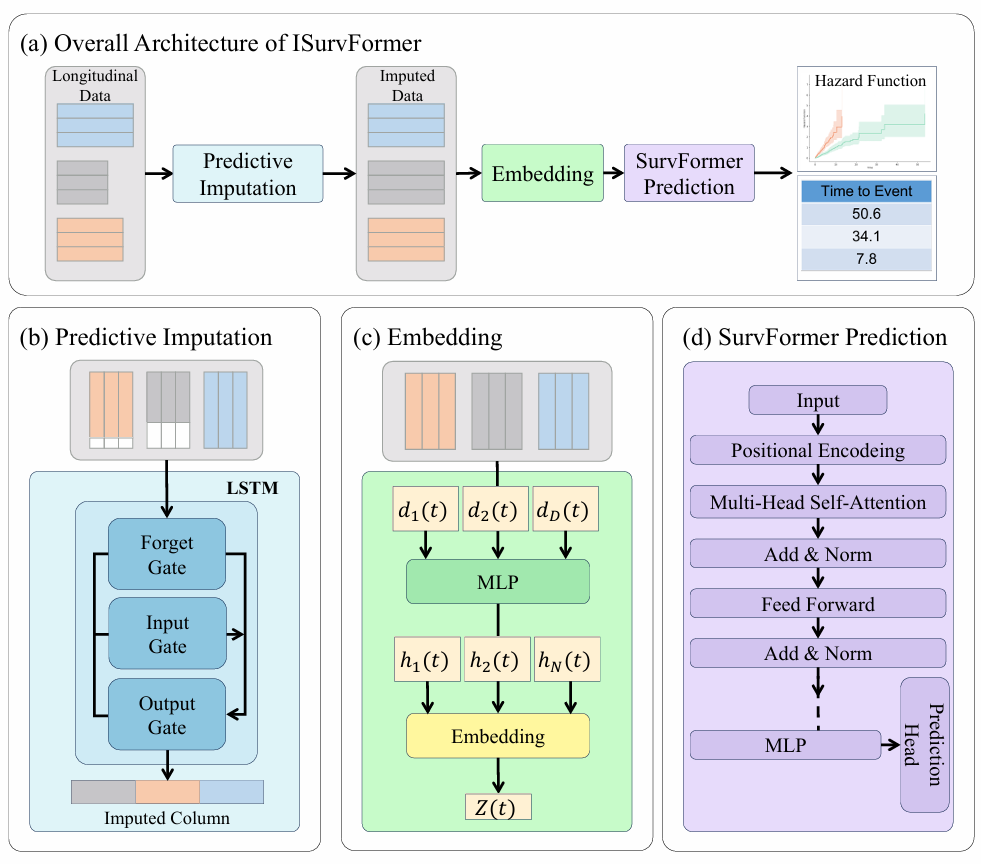

# ISurvFormer: A Transformer-based Dynamic Survival Model with Time-series Predictive Imputation for Longitudinal Data

**ISurvFormer** is a dynamic survival analysis framework designed for longitudinal data. It utilizes predictive imputation via time-series regression to align irregular longitudinal sequences into a regular format and imputes missing values introduced by alignment. The resulting sequences are then fed into a Transformer encoder to predict survival risk.

<div align="center">
  
</div>

---

## Directory Structure

```

├── ISurvFormer/
│   ├── result/                 # Output files: models, logs, clustering results
│   ├── model.py                # Core model definitions
│   ├── data_load.py            # Data loading and preprocessing utilities
│   ├── hyper_search.py         # Optuna-based hyperparameter optimization
│   ├── utils.py                # Training and evaluation utilities
│   ├── main.py                 # Full training pipeline including CV, clustering
│   ├── run.py                  # Quick-start script (single-line entry point)
├── requirements.txt            # Python dependency list
└── README.md                   # Project documentation

```

---

## Installation

Clone this repository:

```bash
git clone https://github.com/JunbeiZhang/ISurvFormer.git
cd ISurvFormer
```

Install dependencies:

```bash
pip install -r requirements.txt
```

**Python Version**:
This project requires `Python >= 3.11`.

---

## Quick Start

Minimal working example:

```bash
python run.py --data AIDS
```

This will automatically load the dataset, perform hyperparameter tuning, and run cross-validation.
The data acquisition methods are provided in the Availability of data and materials section of the paper.

---

## Citation

If you find this work helpful in your research, please consider citing:

```bibtex
@article{zhang2025isurvformer,
  title={ISurvFormer: A Transformer-based Dynamic Survival Model with Time-series Predictive Imputation for Longitudinal Data},
  author={Zhang, Junbei and Zhao, Xuejing},
  journal={ },
  year={2025},
}
```


